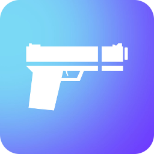

	
LEXOGRINE HUD

	

	
Powered by <a href='https://github.com/lexogrine/hud-manager'><strong>« Lexogrine HUD Manager »</strong></a>

# Lexogrine HUD

  

Fullfledged example of the React HUD made for HUD Manager for Rocket League. For specifics regarding custom settings & keybinds please read [csgo-react-hud documentation](https://github.com/lexogrine/csgo-react-hud)

## Preview

# Download

To download it just click here: [DOWNLOAD HUD](https://github.com/lexogrine/rl-react-hud/releases/latest)

# Instruction
## Setting up
Fork this repo, clone it, and then run `npm install` and `npm start`. HUD should start on the 3500 port. For this to work have HUD Manager opened so it will pass CS:GO data to the HUD.

## Identifying HUD
In `/public` directory edit hud.json so it fits you - fill HUD's name, author and version. At the end replace the thumb.png with your icon :)

## Building & distributing
To build version to distribute and move around, in the root directory run `npm run pack`. It will create the zip file for distribution. Now you can just drag and drop this file into the HUD Managers upload area.

  
 ## File structure
 The HUD is seperated into two parts - the API part, that connects to the HUD Manager API and communicate with it: `src/App.tsx` file and `src/api` directory. Usually, you don't want to play with it, so the whole runs without a problem.
 The second part is the render part - `src/HUD`, `src/fonts` and `src/assets` are the directories you want to modify. In the `src/HUD` each element of the HUD is seperated into its own folder. Styles are kept in the `src/HUD/styles`. Names are quite self-explanatory, and to modify style of the element you should just find  the styling by the file and class name.

